# Carpool

少年野球・サッカーチームなどの配車管理アプリケーション

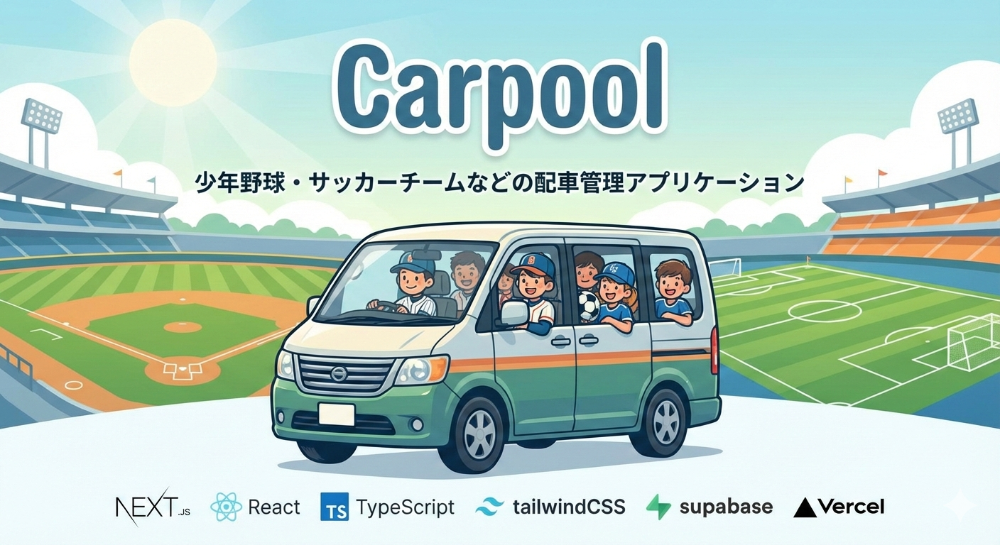

 

## アプリのURL

デモを試せる機能を実装しましたので、登録せずにお試ししていただくことも可能です。

https://carpool-navy.vercel.app/

 

## アプリケーションのイメージ
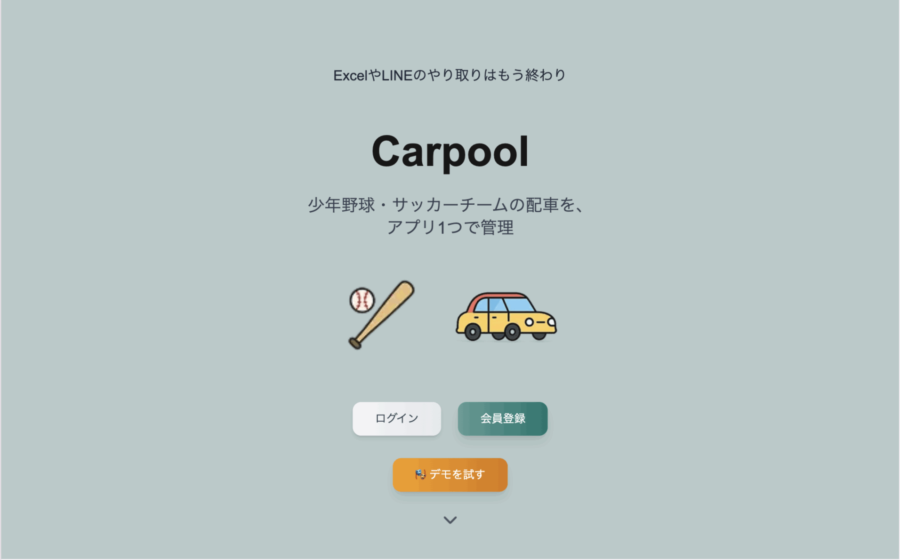

 

## アプリへの想い

私は現在、小学生の息子がいて少年野球の活動を行っています。
実際には、子供だけでなく保護者の活動も多く、遠征の際は配車の割り当てをLINEで手入力して毎週共有していました。
手入力で割り当てを行うのもですが、割り当てられた配車をLINEで遡って確認するのも面倒だと感じ、そんな忙しい保護者の負担軽減を目指し今回開発にあたりました。
管理者がチーム登録、メンバー登録、配車登録を行い、共有のPINコードでメンバーは配車可否の入力を行い、それに基づいて管理者が配車の割り当てを行える仕様になっております。

 

## 機能一覧

| トップ画面 | ログイン画面 |
| ---- | ---- |
| 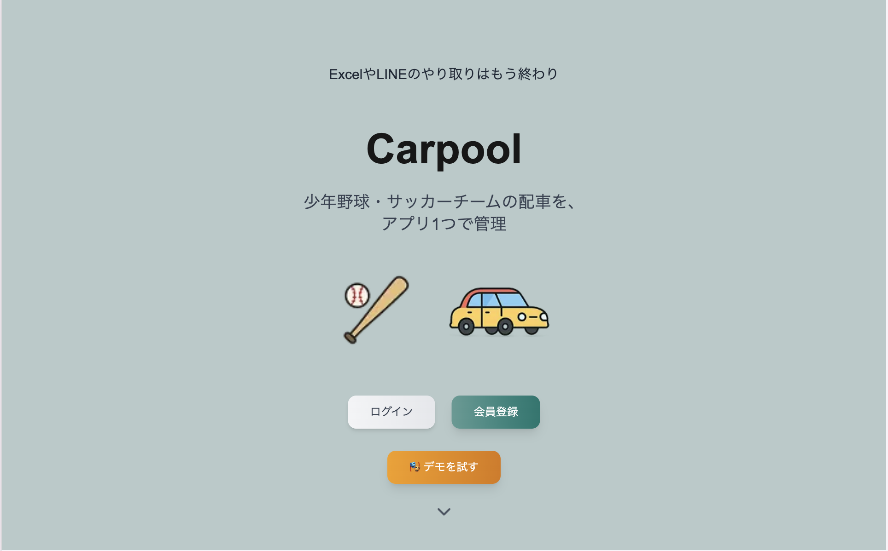 | 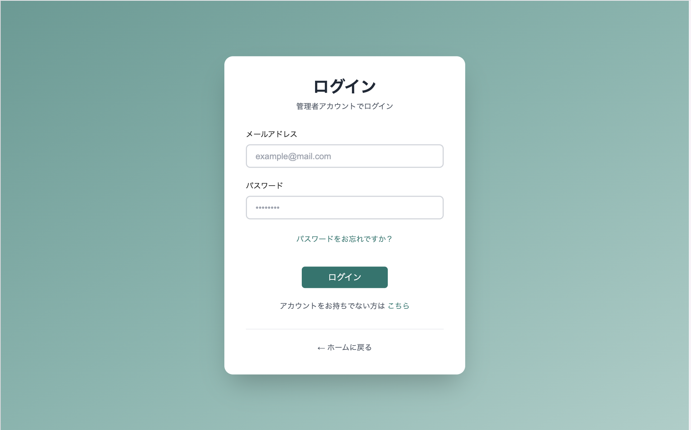 |
| 登録せずにデモをお試しいただける機能を実装しております。 | ログインIDとパスワードでの認証機能を実施しました。 |

| チーム一覧画面 | チーム作成画面 |
| ---- | ---- |
| 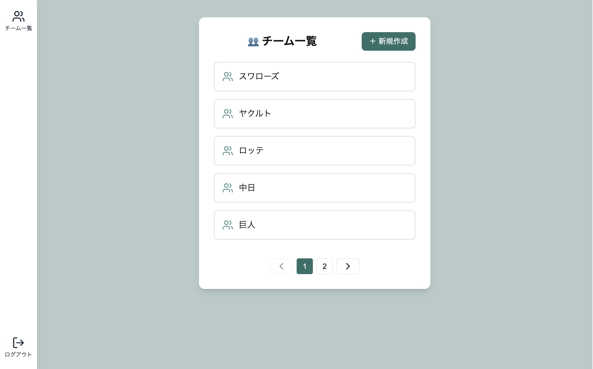 | 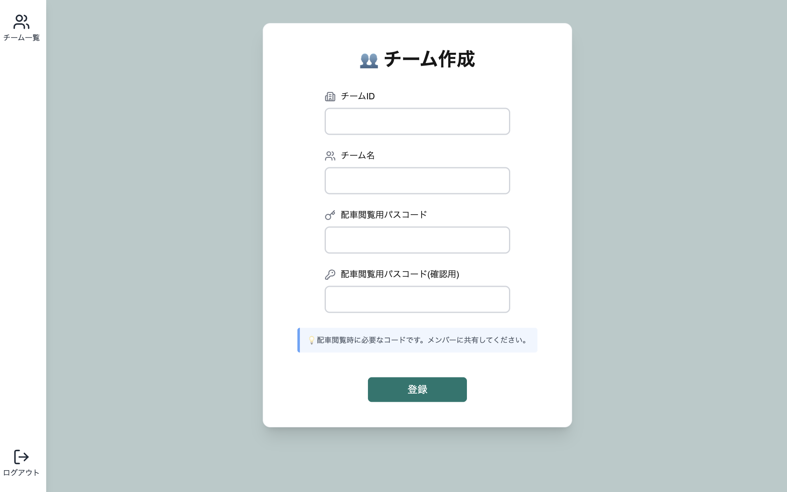 |
| 複数のチームを管理できます。チームごとに配車を作成可能です | 新しいチームを作成します。少年野球やサッカーチームなど |

| メンバー一覧画面 | メンバー作成画面 |
| ---- | ---- |
| 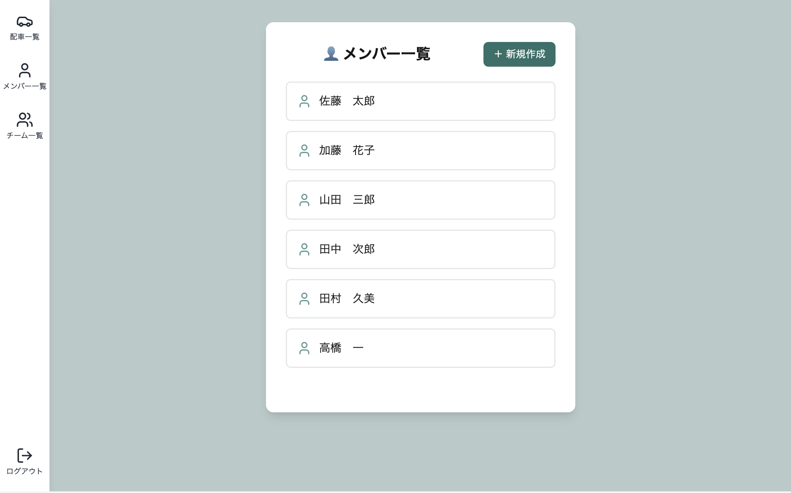 | 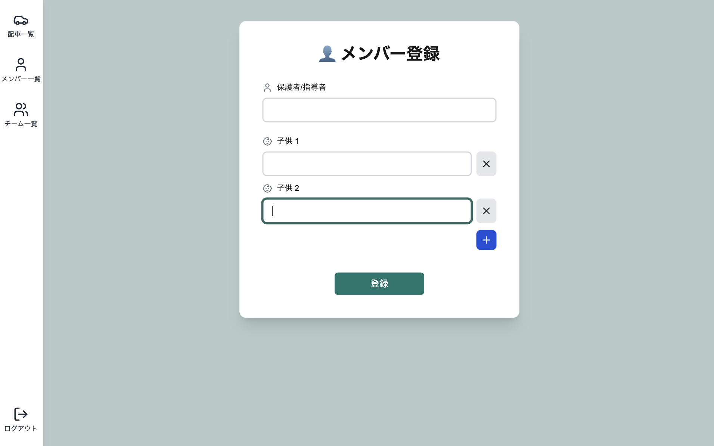 |
| チームメンバーの一覧表示。 | 新しいメンバーを登録。保護者名と子供の名前を登録します。 |

| 配車一覧画面 | 配車作成画面 |
| ---- | ---- |
| 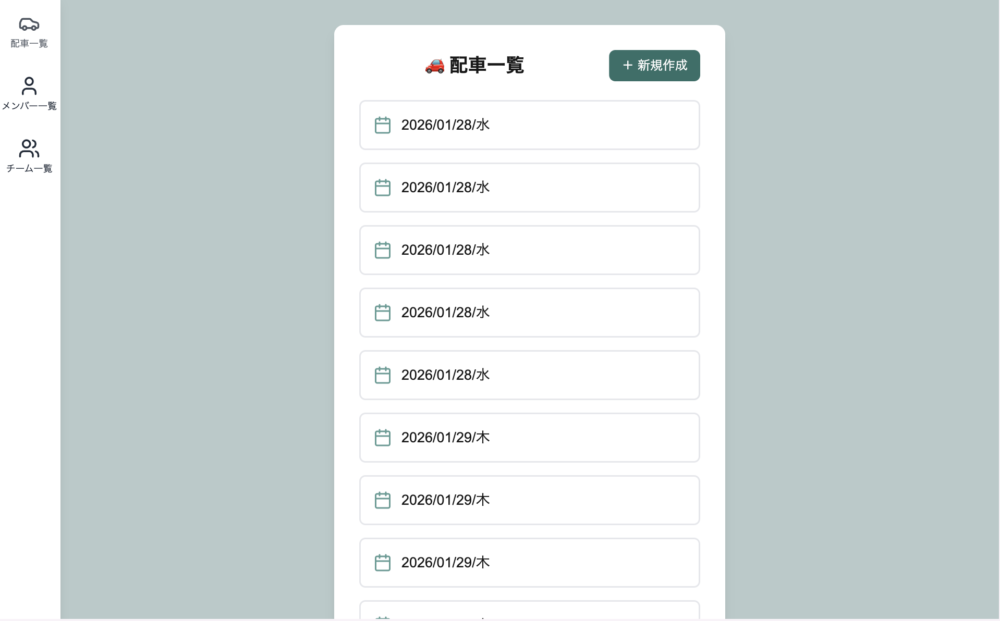 | 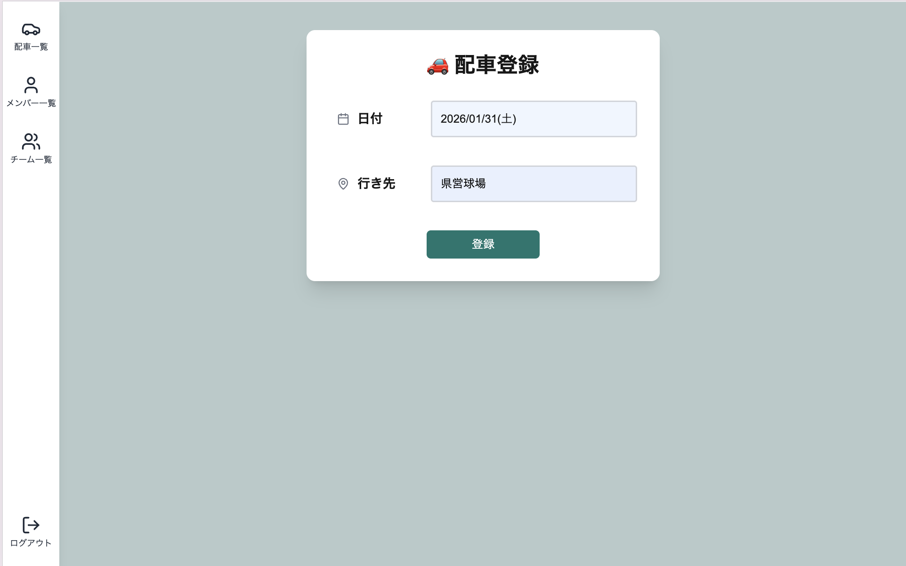 |
| 配車を時系列で確認できます。現在の日付から近い順に並んでます。 | 日付と行き先を指定して配車を作成します |

| PINコード入力画面 | 配車可否入力画面 |
| ---- | ---- |
| 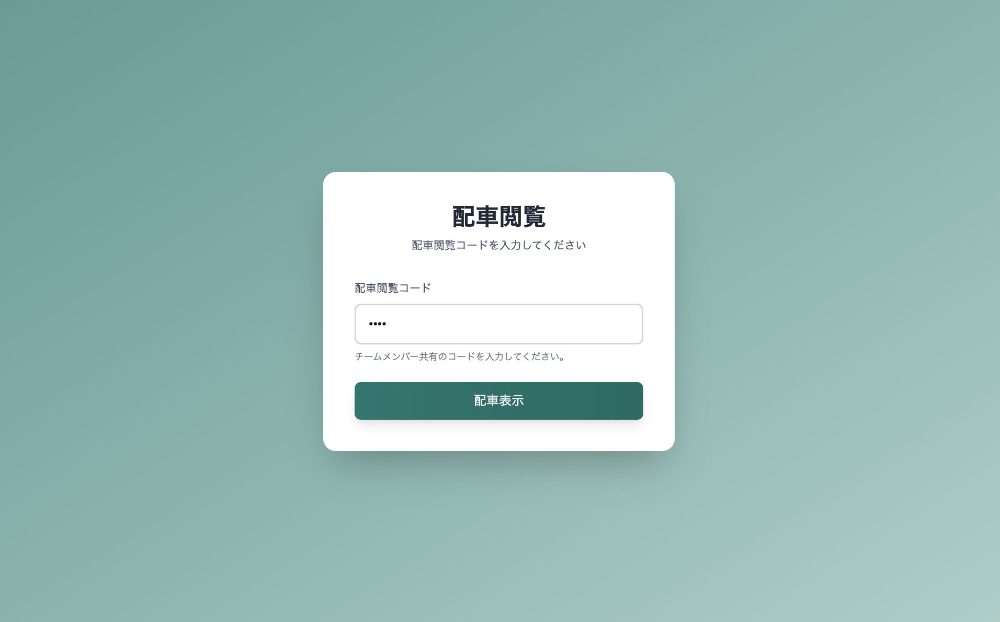 | 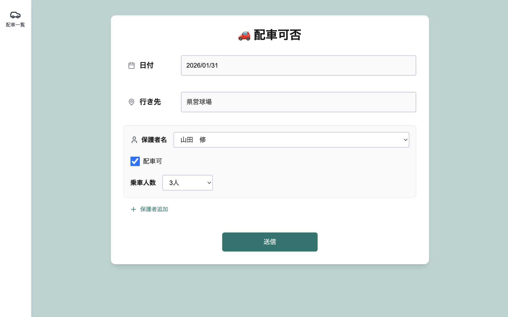 |
| PINコードで簡単アクセス。LINEで共有してメンバー全員が確認できます | 送迎可能かどうかと座席数を入力。リアルタイムで管理者に反映されます。 |

| 配車割り当て画面 | 配車詳細画面 |
| ---- | ---- |
| 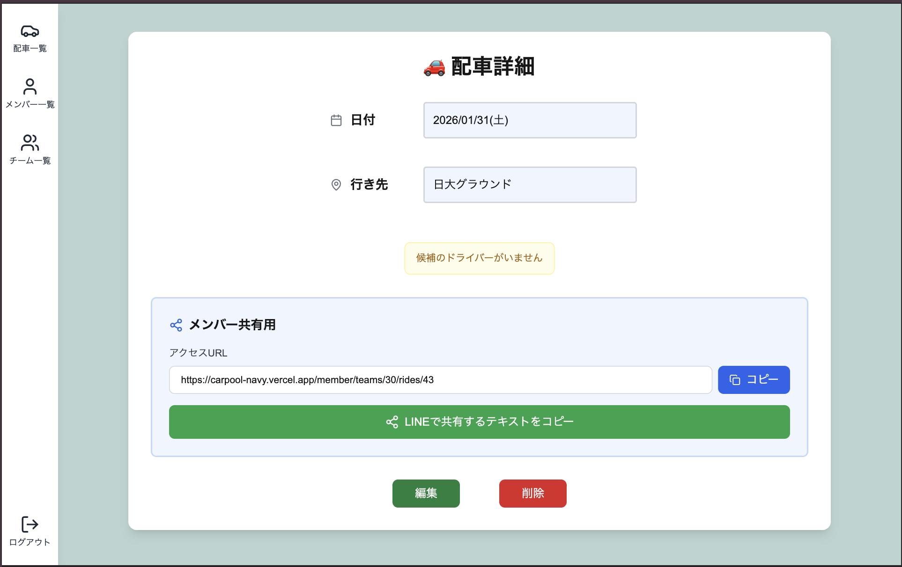 |  |
| ドライバーごとに子供を割り当て、候補ドライバーが不足している場合と、指定された座席数を超えないように警告を表示しています。**メンバー共有用URLとPINコードをワンクリックでコピー可能。LINEなどで簡単に共有できます。** | 完成した配車をメンバー全員で共有。誰がどの車に乗るか一目瞭然です。 |

 

## 主な特徴

###  ワンクリック共有機能

配車詳細画面から、メンバー用のアクセスURLとPINコードを簡単にコピーできます。

- **直接アクセス**: 配車詳細URLを共有することで、メンバーは該当の配車に直接アクセス
- **LINEで共有**: ボタン1つで共有用テキストをコピー。LINEグループに貼り付けるだけ
- **迷わない導線**: PIN入力後、その配車の詳細ページに自動遷移

 

## 使用技術

| カテゴリ | テクノロジースタック |
| ------------------- | ---------------------------------------------------- |
| フロントエンド | Next.js 14, React 18, TypeScript, TailwindCSS |
| バックエンド | Next.js API Routes, Prisma |
| インフラストラクチャー | Vercel, Supabase |
| データベース | PostgreSQL |
| 認証 | Supabase Auth, bcryptjs |
| 状態管理 | SWR, React Hook Form |
| テスト | Jest, React Testing Library |
| UIライブラリ | Lucide React, React Datepicker |
| 環境設定 | Node.js 18+ |
| 等 | ESLint, PostCSS, date-fns, Git, GitHub |

 

## ER図

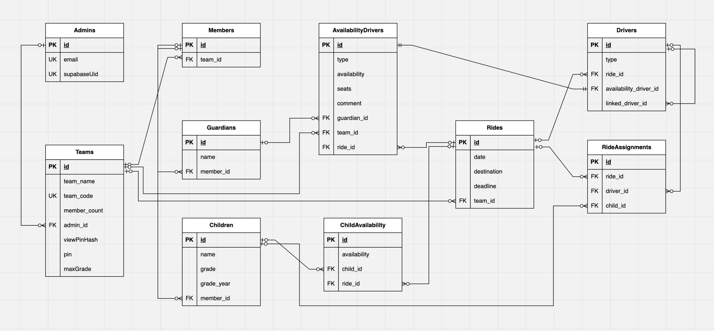

 

## 今後の展望・改善予定

実際に使ってみて感じた改善点や、追加したい機能をリストアップしています。

### UIの改善
- [ ] 今どこのチームにいるかわかるようにしたい（パンくずリストやヘッダー表示）
- [ ] 配車の割当を行った場合は配車一覧ページでわかるようにしたい（ステータス表示）

### ドキュメント整備
- [ ] 使い方の説明を作成（初めての方向けのガイド）
- [ ] 問い合わせフォームを作成

### 機能追加
- [ ] 配車した回数が少ない順に上から並べれば自然と平等になる？（配車回数の可視化）
- [ ] メンバー登録の時に父と母を別々に登録できるようにしたい（複数の保護者対応）
- [ ] 管理者の変更機能
- [ ] アカウント削除機能
- [ ] PINコードの共有方法をもっとスムーズに（QRコード生成など）