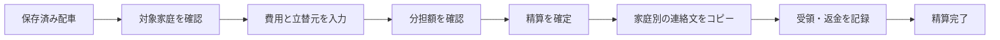

# Carpool 遠征費精算・課金 仕様案

作成日：2026-09-13 / 版：0.1 / 状態：**実装判断用・未承認**

本書は「自動割り当てを課金の軸から外し、配車に関連する運営負担の軽減で課金する」という相談を具体化したもの。以下の価格・機能・計算ルールは提案であり、実装や販売を決定したものではない。

## 1. 最初に判断してほしいこと

**提案する初版は、配車情報から対象家庭を取り込み、遠征費の分担・立替精算・受領確認まで行う機能。** 現在の手動配車を入口に、遠征後の会計作業まで終えられることを価値にする。

| 項目 | 初版の提案 |
| --- | --- |
| 想定利用者 | 遠征費を家庭間で分担している少年野球・サッカー等のチーム |
| 操作する人 | 現在の管理者1人。配車係または会計担当が入力する |
| 支払う人 | チームの承認を得た契約担当者。チーム費からの負担を想定 |
| 主な流れ | 配車保存 → 対象家庭の確認 → 費用入力 → 分担額の確認・確定 → 連絡文コピー → 受領・返金の記録 |
| 無料 | 既存の配車機能。精算は1チームにつき1遠征を最後までお試し |
| 有料 | 2遠征目以降の精算。月980円／チームを検証価格として提案 |
| 分担ルール | 遠征全体の費用を「家庭ごと均等」または「参加する子どもの人数」で分担 |
| お金のやり取り | チーム会計を窓口にする。アプリは金額と記録を管理し、送金しない |
| 初版の地域・端末 | 日本語・日本円・Web。スマホを優先 |
| 後続候補 | 変更の確認状況、複数担当者、保護者による費用申請、車ごとの分担、海外向け対応 |

### 採用の条件と弱点

- 「遠征費を家庭で分担する」「管理者が費用をまとめられる」チームに合う。費用をすべてチーム費で賄う場合や、家庭間の精算がない場合は価値が小さい。
- 車ごと・行き帰りごとに違う金額を請求するチームは初版の対象外。このルールが必須なら、実装前に範囲を変える。
- GoKid等の有料化の考え方を参考にした独自の仮説であり、**この精算機能に月980円を払う需要は未検証**。
- 既存の課金が管理者単位なので、チーム単位の商品を追加する作業が必要。計算画面だけの小変更ではなく、データ・課金・引継ぎにまたがる変更になる。
- 既存Proは維持し、精算を別オプションにする案。複数チーム利用者には料金体系が複雑になるため、第9節の合計料金を含めて採否を判断する。

## 2. 現状と設計上の前提

2026-09-13に現在の作業フォルダを読み取り確認した。以下は手元のコードの状態であり、本番DBや実契約の調査結果ではない。

| 既存の仕組み | 精算への影響 |
| --- | --- |
| `Member`が家庭、`Guardian`が保護者、`Child`が子ども | 父母を別請求にせず、家庭IDで立替・負担をまとめる |
| `Ride`が1回の配車予定 | 初版は1つのRideに1つの精算。複数日をまたぐ合宿の統合は対象外 |
| 手動でドライバー・子どもを割り当て、往復別にも保存できる | 保存済みの乗車情報から対象候補を作る。実際に乗った事実とは区別する |
| 配車PUTはDriverとRideAssignmentを削除・再作成する | 精算をその行IDに依存させない。家庭・人数・配車の根拠を独立したスナップショットにする |
| 欠席回答でも乗車行が削除される場合がある | 確定後の回答変更で精算額を自動変更しない |
| 管理者JWT、メンバーはチーム共通PIN | 共通PINでは「誰の家庭か」を本人確認できない。初版の精算は管理者専用 |
| 現在のProはAdmin単位、月300円／年3,000円 | Team単位の精算権限を別管理する |
| 管理者引継ぎは同じAdminのログイン本人を差し替える | 管理権限とカードの契約担当者を区別する必要がある |
| 自動割り当ての画面導線は撤去済み、内部API等は残る | 本機能では利用・再導入しない。未使用コードの削除は別の整理作業 |

`tasks/todo.md`には2026-09-12の手動配車・Pro文面の公開完了記録がある。本書作成時の検索経由の公開ページ取得には旧文面も出たため、検索取得内容だけで現在の公開状態を断定しない。実装開始時に対象ブランチと公開版を再確認する。

## 3. 初版の範囲

### 含めるもの

1. 配車詳細の「遠征費を精算」入口、チーム内の精算一覧。
2. 保存済み配車からの対象家庭・子どもの取り込みと管理者による確認。
3. 高速代、駐車場代、ガソリン代、その他交通費の入力。
4. 費用を立て替えた家庭、またはチーム会計の指定。
5. 家庭均等／子ども人数の2通りの分担と、1円単位の端数処理。
6. 確定、訂正履歴、家庭ごとの連絡文コピー、印刷用表示。
7. チーム会計への受領・家庭への返金の記録。分割精算にも対応。
8. 1遠征の無料体験とチーム単位の精算契約。

### 初版に含めないもの

- 子どもやドライバーの自動割り当て。
- 保護者の費用申請画面、レシート添付・OCR、複数管理者。
- 家庭間の直接送金先の最適化、送金・集金代行、銀行・PayPay等との接続。
- 車単位／片道単位の按分、走行距離からの燃料費自動算出、運転への報酬計算。
- 一般会計帳簿、部費徴収、弁当注文、試合管理。
- 自動通知、LINEへの自動送信、既読・確認済みの追跡。
- 多言語、多通貨、海外決済、位置追跡、ネイティブアプリの精算画面。

「連絡文をコピー」は送信・既読を意味しない。「精算済み」は管理者が金銭のやり取りを確認して記録した状態であり、銀行等との照合結果ではない。

## 4. 利用の流れと画面



### 画面A：配車詳細・精算一覧

- 配車詳細の保存・連絡操作の後ろに「遠征費を精算」を配置する。配車操作中の課金ダイアログは出さない。
- 未保存の配車変更があるときは、保存してから精算へ進むか、画面に戻るかを選べる。黙って保存・破棄しない。
- チームの「精算一覧」に日付、行き先、合計、下書き／精算待ち／精算完了／取消精算中／取消を表示する。金額未入力は0円ではなく「未入力」。
- 既存精算があればそれを開く。連打や別タブ操作で同じRideの精算を増やさない。

### 画面B：対象・費用の入力

画面上部に配車の日付・行き先、「この遠征全体の交通費をまとめて分担します」を表示する。

| 入力 | 初期値・動作 |
| --- | --- |
| 分担方法 | 「家庭ごと均等」を初期選択。「子どもの人数」に切替可能 |
| 負担する家庭 | 割り当て済み子どもの家庭から候補を作る。管理者が選択を確認 |
| 子ども人数 | 取り込んだ子どもを家庭別に重複除去。管理者が実際の対象を確認 |
| 費用種別 | 高速代／駐車場代／ガソリン代／その他交通費 |
| 金額 | 正の整数円。1明細1〜1,000,000円、合計10,000,000円以下という初版上限案 |
| 立替元 | チーム内の家庭、または「チーム会計」。負担対象外の家庭も立替元にできる |
| 説明 | 任意、200文字まで。「行きの高速」等。その他交通費は説明必須 |

- 初版は管理者が費用をまとめて入力する。保護者が既存のLINE等で知らせた金額を転記する想定。
- ガソリン代はチームで合意した金額を入力する。地図・距離・単価から推測しない。
- 下書きは明示的な保存ボタンでサーバーに保存。未保存での離脱時は確認する。
- 料金が必要な場合は、入力開始前の入口で説明する。大量に入力した後で初めて制限を知らせない。

### 画面C：金額確認・確定

上から「費用合計」「分担方法と対象数」「家庭別の負担額・立替額・差額」「チーム会計の差額」を表示する。

```text
9/20 ○○球場  遠征費
合計 9,000円 / 3家庭で均等

家庭       負担額    立替額    チーム会計との精算
A家        3,000     6,000     3,000円を受け取る
B家        3,000     3,000     やり取りなし
C家        3,000         0     3,000円を支払う

[対象・費用を修正] [この金額で確定]
```

- 確定時に「対象家庭と立替額を確認しました」を確認する。
- 配車取り込み後に元データが変わった場合は、変更ありを表示し、再取り込みまたは現在の対象を使う旨の再確認を求める。
- 下書きの共有出力は不可。確定した版だけを共有する。

### 画面D：連絡・精算記録

- 「家庭別の連絡文をコピー」は対象家庭の金額・日付・行き先・版番号のみ。全家庭の立替額を一括でLINEに貼る機能は初版に作らない。
- 例：「9/20 ○○球場の遠征費（第1版）：C家の負担額3,000円、立替0円。チーム会計へ3,000円をお願いします。」
- 印刷用表示は管理者専用。費用明細・対象・計算根拠・受領記録が確認でき、ブラウザの印刷を利用する。
- 未受領には「受け取った金額を記録」、未返金には「返した金額を記録」を表示。日付・金額を確認して保存する。
- 一部入金では残額を表示。実際に受領していない金額を自動で精算済みにしない。
- コピーの成否や取り消しは通知するが、送信済み・相手の確認済みとは表示しない。

## 5. 対象家庭と計算ルール

### 5.1 対象の取り込み

- 家庭の識別は`Member.id`。保護者名・姓の一致ではまとめない。
- 保存済みの子ども乗車割当を行き・帰り・引率者の割当も含めて集め、`Child.id`で重複を除く。同じ子どもが往復に乗っても1人。
- 割当がないことを欠席と断定しない。未割当・自走の子どもは別欄で示し、管理者が対象に追加できる。
- 欠席回答と割当が矛盾する子どもは自動採用せず、確認対象にする。
- 同じ家庭の父母の立替は同一家庭に合算する。運転者の家庭を自動免除しない。
- 子どものいない運転者・引率者の家庭は、自動では負担対象にしない。家庭均等なら管理者が追加できる。子ども人数方式では負担0人のまま立替だけ登録できる。
- 管理者は負担対象と立替元を独立して選べる。負担対象外の立替家庭にも返金額を表示する。
- チーム外の立替者は初版の対象外。既存の家族登録を使うか、チーム会計で引き受ける運用が必要。
- これは「計画された配車からの候補」。確定時に管理者が実際の参加・負担対象を確認し、精算用の対象として保存する。

### 5.2 負担額

遠征全体の費用合計を`T`、家庭iの重みを`w_i`、重み合計を`W`とする。

- 家庭均等：選択された各家庭の重みを1にする。
- 子ども人数：その家庭で対象にした子ども数を重みにする。
- 除外家庭の重みは0。対象人数・対象家庭が0なら確定不可。
- 基本金額は `floor(T × w_i / W)`。残りの円は小数部分の大きい家庭から1円ずつ加える。
- 小数部分が同じなら家庭IDの昇順。再計算のたびに端数の配分が変わらないようにする。
- 計算は整数の商・余りで行う。画面表示を逆算したり浮動小数点の金額を保存したりしない。
- 各家庭の負担額合計は、必ず費用合計`T`と一致させる。

**初版は費用を合算して一度だけ分担する。** 明細ごと・車ごと・片道ごとの別配分や、家庭別の自由な金額上書きは行わない。

### 5.3 立替の相殺と精算窓口

家庭iの負担額を`B_i`、立替額を`A_i`、チーム会計がその家庭から受領済みの純額を`C_i`とする。家庭へ返した金額は`C_i`のマイナスとして記録する。

`残額_i = B_i - A_i - C_i`

- 残額がプラス：その家庭からチーム会計が受け取る。
- 残額がマイナス：チーム会計からその家庭へ返す。
- 残額が0：その家庭との精算完了。全家庭で0なら精算全体を完了とする。
- チーム会計が直接立て替えた費用は、家庭の立替額には入れない。精算前の家庭差額合計はチーム会計の立替額と一致する。
- 家庭同士の直接送金には初版で対応しない。全額または一部の受領・返金をチーム会計経由として記録する。
- 差額一覧には、現在の負担家庭・立替家庭に加え、過去の受領・返金記録がある家庭も必ず残す。負担対象から外した家庭は負担を0にし、新しい費用明細に残る立替は維持する。負担と立替の両方がなくなった家庭は両方0とし、受領済み純額に応じた返金等を計算する。

### 5.4 確認用の計算例

| ケース | 条件 | 期待する結果 |
| --- | --- | --- |
| 基本・相殺 | 9,000円を3家庭均等。A立替6,000円、B立替3,000円 | Aへ3,000円返金、Bは0円、Cから3,000円受領 |
| 端数 | 1,000円をID順A・B・Cの3家庭均等 | A334円、B333円、C333円 |
| 兄弟 | 1,000円、A家2人・B家1人 | A667円、B333円。家庭均等なら各500円 |
| 往復重複 | A家の子1人が行き帰りの両方にいる | 対象は1人。2人として計算しない |
| 対象外の立替 | A・Bが各500円負担、対象外Dが1,000円立替 | A・Bから各500円、Dへ1,000円 |
| チーム立替 | 3,000円を3家庭均等、全額チーム会計が支払済み | 各家庭から1,000円、チームに合計3,000円戻る |
| 一部受領 | Cの請求3,000円に対し1,000円を受領 | Cの残額は2,000円、全体は未完了 |
| 訂正後の返金 | Cから3,000円受領後、C負担を2,500円に訂正、立替0円 | 過去の受領を残し、Cへ500円返金と表示 |
| 対象なし | 費用あり、重み合計0 | 確定不可。対象家庭の選択へ案内 |

## 6. 確定・訂正・履歴

- 状態は「下書き」「精算待ち」「精算完了」「取消精算中」「取消」。通常の精算待ち／完了は確定版と受領記録から判定する。
- 初回確定時に費用明細・対象家庭名・家庭ID・対象子ども・重み・分担ルール・金額・配車の根拠・計算方式の版を保存する。
- 確定済みの金額を直接上書きしない。「訂正する」で作業用下書きを作り、理由を入力して第2版以降として確定する。
- 訂正中は直前の確定版が有効。訂正を破棄しても直前の金額は残る。
- 訂正しても過去の受領・返金記録は残す。新しい金額から実際の受領済み純額を引いて、追加請求／返金を求める。
- 受領記録の入力ミスは元記録を消さず、理由付きの取消記録を追加する。「実際に返金した」と「誤った記録を取り消した」を区別する。
- 1回の受領・返金は現在の残額まで。超過は受け付けず、記録内容を確認してもらう。元記録の取消は、現在残額の上限ではなく、未取消の原記録との完全一致で検証する。
- 金額・対象・受領記録の更新には版番号を必須とする。他タブの変更と競合したら409で再取得を案内し、後勝ちで上書きしない。
- 全体取消には理由が必要。受領・返金の純額がすべて0なら、そのまま取消できる。
- 純額が残っている場合は「取消精算中」にし、原版を保持した取消用の版で全家庭の負担・立替を0にする。この状態の残額は`-C_i`となり、受領済みの家庭には返金、返金済みの家庭からは返してもらう金額を示す。例えば3,000円を受領済みなら、取消開始後は3,000円の返金を記録できる。
- 取消精算中は通常の費用編集・再確定を禁止し、実際の返金・受領と記録ミスの取消だけを許可する。全家庭の純額が0になった時点で取消完了。記録取消を実際の返金の代わりに使わない。
- 取消済みの精算も履歴に残し、無料体験は復活させない。取消操作の巻き戻しは初版に含めない。
- 配車・名簿の変更や削除で確定版を再計算しない。名前変更・退団後も確定時の記録で説明できる状態にする。

## 7. 無料体験と課金するタイミング

| 操作 | 無料体験の対象遠征 | 有効な精算契約 | 未契約・契約終了後 |
| --- | --- | --- | --- |
| 既存の配車・回答・共有 | 利用可 | 利用可 | 利用可 |
| 新規精算の作成 | 対象の1遠征のみ | 利用可 | 対象の無料体験がなければ不可 |
| 未確定の下書き閲覧 | 利用可 | 利用可 | 利用可 |
| 未確定の下書き編集・初回確定 | 対象の1遠征のみ | 利用可 | 体験対象を除き不可 |
| 過去の確定版の閲覧・コピー・印刷 | 利用可 | 利用可 | 利用可 |
| 確定済みの同じ遠征の訂正・受領・返金・取消 | 利用可 | 利用可 | 利用可 |

- 無料体験はカード登録不要。1チームの1遠征を、共有・精算完了まで利用できる。
- 最初の無料下書きを作るときに対象遠征を予約し、初回確定時に消費する。確定前だけ対象を変更できる。並行して複数遠征を無料確定できないようDBで保証する。
- 料金案内は2遠征目の作成時。「この遠征の精算を始めるには月980円／このチーム」を表示する。
- 契約終了後も、すでに確定した同じ遠征の誤り訂正や未精算の処理を続けられる。既存の金額が間違ったままになる課金制限は設けない。
- 既存精算を別の遠征に付け替えて無料枠を使い回す操作は不可。紐づくRide・初回確定時の日付と行き先は履歴として固定する。
- 作成権限のない2遠征目では、下書きを作る前に料金を案内する。Checkoutには元のRideと復帰先を保持し、契約確認後に初めて下書きを作る。購入取消時は元の配車へ戻す。
- すでに下書きがある場合は、保存済みの内容を保持したまま契約を案内し、成功・取消・タイムアウトのどの場合も同じ精算へ戻す。編集中に失効した場合は未保存入力を同じタブの復帰用下書きとして保護し、更新・契約の再確認後に保存する。失効中に確定は行わない。
- 成功URLに戻っただけでは有料権限を付けない。サーバーで対象契約を確認し、反映待ちのときは再申込を促さない。

## 8. 権限・情報の扱い

- 費用入力・閲覧・確定・受領記録は、現在のチーム所有者である管理者JWTに限定する。
- 既存の共通PINでは、精算額・立替額・契約情報を返さない。通常のメンバーAPIのレスポンスにも追加しない。
- APIでは常に管理者のTeam所有権と精算のTeam所属を確認する。初回作成・元配車の再取り込み・現在の名簿からの対象追加では、Rideや追加する家庭・子どもがそのTeamに所属することも検証する。
- 既存履歴の閲覧・訂正・受領処理は、その精算に保存された家庭・子どものスナップショットIDを検証する。元Rideや名簿の行が削除済みでも操作できる。過去のIDを使って別チームの対象を新規追加することは許可しない。
- 印刷・家庭別コピーも管理者が行う。初版は新しい公開精算URL、家庭別秘密リンク、電話番号・口座番号の入力を作らない。
- 新規DBテーブルは公開ロールから直接読み書きさせない。RLSと権限制御を設定し、サーバーの認証済みAPI経由に限定する。
- 分析イベントやエラーログに、家庭名・子どもの名前・PIN・費用明細・カード情報を入れない。
- 同じチーム内での家庭別公開や保護者本人の操作は、本人確認方式を設計する次期機能とする。

## 9. 料金・契約の設計案

### 9.1 既存Proとの関係

初版では既存Proを置き換えず、**「遠征費精算オプション」月980円／チーム**を追加する。価格表示は税込総額という提案。年払い・海外通貨は後回しとし、販売設定と表示額を公開前に照合する。

| 利用例 | 月払いの場合の提案料金 |
| --- | --- |
| 1チームで配車だけ | 0円 |
| 1チームで精算も利用 | 980円 |
| 現行Proで複数チーム管理だけ | 300円 |
| 現行Pro＋1チームで精算 | 1,280円 |
| 現行Pro＋2チームで精算 | 2,260円 |

- 精算だけのためにPro加入は要求しない。Free管理者が自分の1チームに精算を購入できる。
- 既存Proの価格・複数チームの権限は維持し、980円へ自動変更しない。年払い契約も現在の周期のまま。
- 精算契約から別チームの精算権限や複数チーム作成権限は発生させない。
- 申込前に既存契約・今回の追加額・契約周期・対象チームを明示する。年払いProと月払い精算を一つの月請求に見せない。
- この併存案は既存契約への影響を小さくするための案。料金を一本化したい場合は移行設計を別途決め、公開前に再検討する。

### 9.2 契約状態

- 正常な有効契約で新規精算を許可する。解約予約は当期末まで利用可能。
- 初回未払い・契約未完了・支払遅延・停止・失効では新規作成と未確定データの確定を止め、支払管理へ案内する。無料体験と確定済み精算の処理は第7節に従う。
- 解約・支払更新はStripe Portalを利用。アプリは家庭間の送金を扱わない。
- 契約確認が一時的に失敗したら「確認できません」を表示する。新規契約成功や失効を推測して表示しない。

### 9.3 二重契約・既存課金への干渉を防ぐ

- 現行CheckoutはAdminのStripe Customer内の契約全体を重複判定に使う。**精算契約のCustomerを既存Proと共有しない。** チーム・契約担当者の単位で分離する。
- 新しいAPIはTeam配下に設ける。サーバーで許可したPrice ID、対象Team、契約担当者を決め、クライアント指定の金額や権限を信用しない。
- Teamごとの申込予約行と冪等キーを用い、同時クリック・別タブ・応答切断でも同一の申込を再利用する。外部API応答不明時に新しいキーで再課金しない。
- DBの予約確保と確定は短いトランザクションで行い、Stripeへの通信中は行ロックを保持しない。失敗・期限切れの予約はStripe状態を照合してから再開する。
- webhookは署名を検証し、DB上のCustomer／Subscriptionと商品・Priceを照合してProと精算へ振り分ける。不明な商品に権限を付けない。
- 再送と順不同で権限が巻き戻らないよう、契約同期を直列化し、Stripeから取得した現状との整合を再確認する。旧契約の遅延通知で新契約を上書きしない。
- 購入成立は契約IDで一度だけ記録。既存Proの成立記録とは商品種別・チームIDで区別する。更新請求を新規購入件数に数えない。

### 9.4 担当者交代

現状の引継ぎは同じAdminのログイン本人を変更する。Admin IDだけで支払管理を許可すると、新担当者が旧担当者のカード契約を操作できるため、販売前に対応する。

- 契約担当者の本人IDを、チーム管理者IDとは別に保存する。表示メールだけで所有者を決めない。
- 初版の推奨手順は「旧担当者が関連する有料契約の自動更新を止める → 未完了の申込を閉じる → 管理権限を引継ぐ」。未払い・処理中の契約があれば先に解消する。
- 引継ぎの開始と完了時の両方で状態を確認する。引継ぎ中は新規Checkoutを開始できない。
- 支払済み期間の利用権と精算記録はチームに残る。旧担当者のCustomer／Portalを新担当者に渡さない。
- 新担当者の契約は前契約の期間終了後に、新しいCustomerと本人IDで開始する。カードを暗黙に引き継がず、同じチームの重複する有料期間を作らない。
- 既存Proも契約担当者の区別が必要。既存契約の本人対応が確認できない場合は自動的に紐付けず、販売開始前の移行確認対象にする。
- 無料チームの引継ぎ手順は維持する。有料契約を伴う引継ぎに確認工程が増えることは、実装判断で了承が必要。

## 10. データ・API・実装箇所の案

### 10.1 保存する情報

以下は論理設計。実装時にPrismaの型・制約・migrationへ落とす。

| 新設モデル案 | 主な内容・制約 |
| --- | --- |
| `RideSettlement` | teamId、rideId、状態、version、下書き、現在の確定版、作成者。rideIdは一意。配車削除時は参照をnullにして履歴を残す |
| `SettlementRevision` | settlementId＋revisionを一意にする。費用・家庭・子ども・重み・負担額・立替額・元配車の要約を不変のJSONBとして保存。計算方式の版・訂正理由・作成者・日時を含む |
| `SettlementMovement` | 対象精算・家庭のスナップショットID・受領／返金／記録取消・整数金額・日時・操作者。操作キーを一意にし、同じ原記録の取消は1回まで |
| `TeamSettlementAccess` | teamIdを一意にし、無料体験の予約対象・初回確定対象と申込予約を保持。取消・解約・対象Ride削除でも体験消費を戻さない |
| `TeamSettlementSubscription` | teamId、契約担当者本人ID、Customer・Subscription・CheckoutのID、状態・有効期限・商品と価格、同期状態。契約履歴を保持し、他人への引継ぎで旧契約を上書きしない |

- 下書きと確定版のJSONはサーバー側で構造・型・上限を検証する。金額計算と確定版の作成はサーバーを正とする。
- 過去の家庭・子ども・ドライバーに必須の連鎖削除FKを作らない。精算内の安定したIDと名前の写しで履歴を維持する。
- 確定・訂正・受領・取消・無料枠消費は、精算versionと必要なアクセス行を確認して一つのDBトランザクションで整合させる。ロック順序を統一する。
- teamId／settlementId等の検索・外部キーに索引を設ける。履歴一覧はページ分割。新規の金額は円の整数で、通貨は`JPY`を明記する。
- 配車取り込みの根拠は一貫したDBスナップショットから取得する。Driver行IDやRideのupdatedAtだけに依存せず、家庭・子ども・方向等の意味のある値で変更を検出する。
- 家庭追加・改名・退団後も旧版を再構成できる。訂正画面では過去の精算対象を利用できるようにし、現在の名簿との一致を強制しない。

### 10.2 削除への影響

- 名簿や配車の通常削除で、確定した精算・受領記録を連鎖削除しない。元配車がなくなった精算もチームの精算一覧から閲覧・処理できる。
- Ride削除後は精算から新しいRideへ付け替えない。スナップショットの日付・行き先を表示する。
- Team削除は、有効／未完了の精算契約または未精算がある間は止め、解約・精算へ案内する。
- その後のTeam削除では精算履歴も消えることを明示する。課金照合に必要な最小契約記録は別途残し、家庭名・精算明細の保持とは分ける。
- 新規テーブルの削除制約と、既存Team・Ride・Member削除APIの挙動を合わせる。既存データを一括削除するmigrationは作らない。

### 10.3 API案

| API | 役割 |
| --- | --- |
| `GET /api/admin/teams/[teamId]/settlements` | 精算一覧・過去の履歴 |
| `POST /api/admin/teams/[teamId]/rides/[rideId]/settlement` | 対象の取り込みと下書き作成。既存ならそれを返す |
| `GET/PATCH /api/admin/teams/[teamId]/settlements/[settlementId]` | 詳細取得／下書き保存。PATCHはversion必須 |
| `POST .../settlements/[settlementId]/confirm` | 初回確定／訂正版確定。サーバー計算と権限・無料枠検証 |
| `POST .../settlements/[settlementId]/amend` | 訂正用下書きの作成。現在版を維持 |
| `POST .../settlements/[settlementId]/refresh-source` | 下書きに元配車を再取り込み。対象変更を明示確認 |
| `POST .../settlements/[settlementId]/movements` | 受領・返金・記録取消の追加 |
| `POST .../settlements/[settlementId]/void` | 取消開始。残額があれば取消精算中、なければ取消完了。履歴は残す |
| `GET/POST /api/admin/teams/[teamId]/settlement-billing/{status,checkout,portal}` | 状態取得はGET、Checkout・Portal作成はPOST |

すべての更新は認証・所有権・状態・金額を検証する。操作IDとversionを使い、二重確定や二重受領を防ぐ。認証失敗401、対象外404、入力エラー400、競合409、追加契約が必要な操作402、外部確認不能503を基本とする。既存APIのエラー形式は新機能のために一括変更しない。

### 10.4 主な変更箇所

行番号は2026-09-13の読み取り時点。新設ファイル名は案。

| 既存ファイル／新設領域 | 変更理由 |
| --- | --- |
| [prisma/schema.prisma](/Users/yabekoudai/Documents/carpool/prisma/schema.prisma:15)、新規migration | 精算履歴・チーム契約・契約担当者の保持 |
| [配車詳細](/Users/yabekoudai/Documents/carpool/src/app/admin/teams/[teamId]/rides/[rideId]/page.tsx:157) | 精算入口、未保存入力の保護、既存手動配車の維持 |
| `src/app/admin/teams/[teamId]/settlements/`（新設） | 一覧、入力、確認、履歴、印刷用表示 |
| `src/utils/settlementCalculation.ts`（新設） | 純粋な整数計算・端数配分・相殺・残額計算 |
| `src/app/api/admin/teams/[teamId]/settlements/`（新設） | 管理者専用の精算API |
| [withAuth.ts](/Users/yabekoudai/Documents/carpool/src/utils/withAuth.ts:80)と新設の精算認証補助 | 現ラッパーのTeam所有確認に加え、Ride・精算との所属一致を保証 |
| [配車API](/Users/yabekoudai/Documents/carpool/src/app/api/admin/teams/[teamId]/rides/[rideId]/route.ts:200) | 保存時に作り直す乗車行と精算を分離し、削除時に履歴を保持 |
| [Team削除API](/Users/yabekoudai/Documents/carpool/src/app/api/admin/teams/[teamId]/route.ts:50) | 契約・未精算が残る状態の削除を防ぐ |
| [現行Checkout](/Users/yabekoudai/Documents/carpool/src/app/api/admin/billing/checkout/route.ts:42)、Team課金API（新設） | 既存Proの重複防止を壊さず、精算商品を別Customerで扱う |
| [webhook](/Users/yabekoudai/Documents/carpool/src/app/api/stripe/webhook/route.ts:21)、[課金同期](/Users/yabekoudai/Documents/carpool/src/utils/billingSubscription.ts:9) | 商品の振分け、冪等な契約同期と成立記録 |
| [引継ぎ完了API](/Users/yabekoudai/Documents/carpool/src/app/api/admin/me/transfer/complete/route.ts:44)、申請API、Portal API | 管理権限の移転と契約担当者の分離 |
| [プロフィール](/Users/yabekoudai/Documents/carpool/src/app/admin/profile/page.tsx:140)、チーム画面、[LP](/Users/yabekoudai/Documents/carpool/src/app/page.tsx:54) | 現行Proと精算の範囲・追加額を明示 |

通常のメンバー回答API・無料配車の計算・共有URLは、新しい精算の都合で変更しない。変更通知は本版の対象外のため、配車更新と精算通知を連動させない。

## 11. 検証・受入条件

以下は実装後に満たすべき条件であり、本書作成時点で実施済みという意味ではない。

### 計算・履歴

- 第5.4節の全例と、ランダムな金額・人数でも負担額合計＝費用合計を満たす。
- 往復・兄弟・父母・引率者の割当を二重に数えない。自走・未割当・欠席矛盾を確認できる。
- 立替対象外家庭、チーム会計の立替、一部受領、訂正後の追加請求・返金を正しく表示する。
- 訂正で除外した受領済み家庭が差額一覧に残る。全体取消で取消精算中に遷移し、実際の返金・受領後に完了できる。通常の残額制限で取消の返金が妨げられない。
- 確定後の配車再保存、欠席変更、改名、退団、Ride削除で確定額と履歴が変わらない。
- 費用未入力、対象0人、負数、小数、上限超過、不正な家庭IDで確定できない。

### 課金・認証・並行操作

- 別チームの管理者と共通PIN利用者は精算を取得・更新できない。ネストしたIDの差し替えも拒否する。
- 同時に2遠征を確定しても無料体験は1件だけ。確定・受領・記録取消の二重送信は1回分だけ反映する。
- 実PostgreSQLで並行更新・途中失敗・ロールバックを検証する。モックテストだけで競合対策完了としない。
- Stripeテスト環境で購入・取消・重複クリック・通知再送／順不同・支払失敗・解約・再契約を確認する。
- 精算契約でAdmin Proが書き換わらず、Pro契約で別チームの精算が有効にならない。
- 契約失効後も過去精算の確認・訂正・受領処理ができ、新規精算だけが契約条件に従って止まる。
- 担当者交代後、新担当者に旧CustomerのPortalが開かず、支払済み期間と履歴が維持される。

### UI・既存機能

- 390px幅とPCで、対象確認→入力→確定→コピー→一部受領→完了→再読み込みまで確認する。
- 小さい画面でも家庭名・支払う／受け取る方向・残額が省略されず、色だけに依存しない。
- Checkoutからの復帰、ブラウザ戻る、通信失敗、別タブ競合で入力を失わない。
- 手動配車・家族登録・回答・共有・現行Proの回帰テストを実行する。
- TypeScriptを別途検証する。現設定はbuildが型・lintエラーを無視し得るため、build成功だけで完了としない。
- ブランチ内のテスト・型確認・lint・buildと認証済み画面を確認し、本番の契約設定や保存→再読込の確認とは分けて報告する。

## 12. 実装の進め方と海外への展開

### 実装を選んだ場合の順序

1. **ルール確認・画面案**：実際の1遠征の例で家庭均等／人数方式、チーム会計経由、価格に無理がないか確認する。
2. **精算本体**：計算・対象取り込み・保存・確定・履歴・受領・印刷を実装し、限定した試用チームで操作確認する。試用権限は明示的な期限付き付与として管理する。
3. **販売に必要な部分**：Team課金、無料体験、webhook、既存Proとの併存、引継ぎ・削除の保護を実装する。
4. **販売前の検証**：テスト環境の購入から解約まで、実DBの並行更新、PC・スマホ画面を確認する。
5. **公開判断**：差分・検証結果・残る制約を見て公開を判断する。push・PR・本番migration・販売設定は今回の仕様書作成には含まない。

精算本体のみの承認と、課金を含む販売版の承認を分けて判断できる。販売版の完成条件は第11節までを満たすこと。部分実装を「課金可能な状態」とは報告しない。

### 課金仮説の検証案

- 対象5チームに、直近の遠征の計算時間・転記回数・催促回数・精算方法・チーム費からの購入可否を確認する。
- 1遠征を体験してもらい、精算の作成数だけでなく、確定・受領完了・2遠征目・実契約・更新を別に確認する。
- 継続利用者の作業時間が減り、5チーム中2チーム以上が提示価格で有料継続することを、初期の継続開発判断の目安とする。少数の探索であり、市場全体の需要を証明する値ではない。
- GA等では入口、下書き保存、初回確定、コピー、精算完了、料金表示、Checkout開始、契約成立を分ける。コピーを送信、料金表示を購入として数えない。
- 契約成立はサーバーの記録を正とする。無料体験・試用付与・運営アカウントを有料契約に含めない。

### 海外は次段階

- 初版は日本語・円のみ。金額と通貨、表示言語と計算を分けておき、後から各国通貨の小数桁や日付表示を追加できる構造にする。
- 現地で試せるチームを見つけ、費用分担・支払者・シーズン期間を確認してから対応国を決める。月980円を単に為替換算した価格にはしない。
- 既存チャットから使える補助ツールという方向を保ち、チーム管理全体の置き換えを前提にしない。
- 精算ニーズがなければ、変更連絡・確認状況を次の候補として再評価する。海外機能を先回りして初版に詰め込まない。

## 13. 採否を決めるときの確認表

未回答でも本書は判断材料として読める。実装前に下記の提案を採用するか確認する。

| 判断項目 | 本書の推奨案 | 変える場合の影響 |
| --- | --- | --- |
| 最初の有料価値 | 遠征費精算に絞る | 通知・共同管理も含めると認証や外部連携が増える |
| 費用の分担 | 全体合算、家庭均等／子ども人数 | 車別・片道別なら対象と費用の紐付けを追加する |
| お金の窓口 | チーム会計経由 | 家庭間の直接精算なら送金関係と受領確認を別設計する |
| 入力者 | 管理者1人が費用をまとめる | 保護者入力には家庭の本人確認と承認処理が必要 |
| 初版価格 | 月980円／チーム、1遠征無料 | 正式価格・税表示・試用条件を決めて販売設定に反映する |
| 既存Pro | 据置＋精算別オプション | 一本化には既存契約移行と複数チーム権限の再設計が必要 |
| 契約担当者の交代 | 自動更新停止後に管理権限を移転 | 期間をまたぐ契約移転を望むなら追加設計が必要 |
| 承認範囲 | 精算本体を先に試し、販売版へ進めるか判断 | 一括実装なら第9〜11節も最初から必須 |

## 14. 参考と確認範囲

- [GoKid公式FAQ](https://gokid.mobi/faq/)（2026-09-13確認）：基本機能を無料とし、履歴・通知設定・チャット・位置確認を家族向けProで提供。月4.99ドル／年49.99ドル。参考にするのは無料／有料の分け方であり、本書の遠征費精算の需要を証明するものではない。同FAQでは学校プログラムのガソリン代分担はアプリ内で扱わないとも説明している。
- [TeamSnap公式の担当割当説明](https://helpme.teamsnap.com/article/387-create-team-assignments)（2026-09-13確認）：担当割当で配車を調整する例がある。手動配車だけを海外独自の機能とは扱わない。
- 現状の根拠：第10.4節の実コードと、`tasks/todo.md`の既存作業記録。本書作成では本番DB・Stripeアカウント・課金件数を取得していない。

**作成したのは本仕様書と作業記録のみ。アプリ、DB、契約、公開状態は変更していない。**
